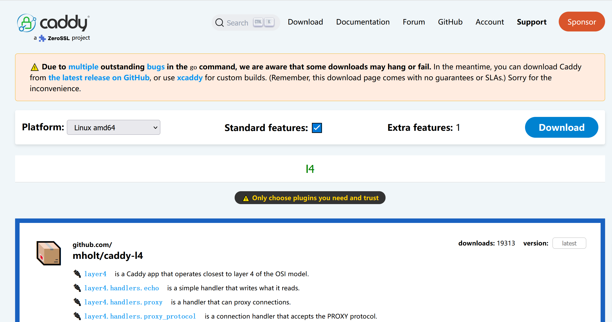

搭建方法和代理资源支持参考：https://danwin1210.de/github-ipv6-proxy.php

> 我开始建立起一个WireGuard VPN， 为此我使用了我的一个双核服务器另外一个可以让用于Tor匿名下载
>
> 当然我不是唯一一个有着IPv6问题的用户， 所以我决心将它作为一个公共代理服务器这样所有人都可以使用它进行GitHub仓库下载这个服务仅针对IPv6用户IPv4用户可以直接克隆GitHub仓库所以没有必要浪费服务器资源
>
> 注意，我的https代理正在为我的域名提供SSL验证服务。 这意味着我会解密并重新加密你的通信(我有能力直接监听你的通信，但我不会这么干). 你 有必要获得有关SSL验证的警告 Github会在接受警告之后重定向到默认端口以下是一个更能保护隐私的方法

那些希望永久使用我的服务的人 在我没有重新加密你的通信的情况下，应该添加这些内容到 `/etc/hosts` :


```txt
2a01:4f8:c010:d56::2 github.com
2a01:4f8:c010:d56::3 api.github.com
2a01:4f8:c010:d56::4 codeload.github.com
2a01:4f8:c010:d56::6 ghcr.io
2a01:4f8:c010:d56::7 pkg.github.com npm.pkg.github.com maven.pkg.github.com nuget.pkg.github.com rubygems.pkg.github.com
2a01:4f8:c010:d56::8 uploads.github.com
2606:50c0:8000::133 objects.githubusercontent.com www.objects.githubusercontent.com release-assets.githubusercontent.com gist.githubusercontent.com repository-images.githubusercontent.com camo.githubusercontent.com private-user-images.githubusercontent.com avatars0.githubusercontent.com avatars1.githubusercontent.com avatars2.githubusercontent.com avatars3.githubusercontent.com cloud.githubusercontent.com desktop.githubusercontent.com support.github.com
2606:50c0:8000::154 support-assets.githubassets.com github.githubassets.com opengraph.githubassets.com github-registry-files.githubusercontent.com github-cloud.githubusercontent.com

# 新增的
2602:f92a:220:249::109 raw.githubusercontent.com

```

如果你对搭建感兴趣，可以阅读剩余部分

<!--more-->
--------------

## 如何搭建？

### 1. 需要安装 [caddy-l4](https://github.com/mholt/caddy-l4) 第三方模块

danwin 使用 nginx stream 方案，这个方案基于L4（传输层）
恰好 caddy 中有同样的模块，虽然不是官方维护，但开源好用。

访问 [https://caddyserver.com/download](https://caddyserver.com/download) 地址，按照下图进行选择。模块搜索 l4，按图选择，点击 download 下载

 



### 2. 将下载的文件传到 vps 上

[caddy_linux_amd64_custom.zip](https://raw.githubusercontent.com/renshengyoumeng/techblog/main/使用caddy搭建github-ipv6-proxy/caddy_linux_amd64_custom.zip)

### 3. 安装

安装文档均可在[官方](https://caddyserver.com/docs/install#static-binaries)找到。此处同样列出一份

一些安装方式会自动把 Caddy 设置为服务。如果你选择的方式没有这样做，你可以按以下步骤操作：

要求：

- 你下载或从源代码构建的 caddy 二进制文件
- systemctl 版本必须为 232 或更新
- sudo 权限

将 caddy 二进制文件移动到你的 `$PATH`，例如：

```bash
sudo mv caddy /usr/bin/
```

测试是否成功：

```bash
caddy version
```

创建名为 caddy 的用户组：

```bash
sudo groupadd --system caddy
```

创建名为 caddy 的用户，并带有可写 home 目录：

```bash
sudo useradd --system \
    --gid caddy \
    --create-home \
    --home-dir /var/lib/caddy \
    --shell /usr/sbin/nologin \
    --comment "Caddy web server" \
    caddy
```

如果使用配置文件，请确保刚创建的 caddy 用户能读取该文件。

接下来，根据你的场景选择合适的 systemd 单元文件。

我使用 ubuntu 24.04，因此采用[这个：](https://github.com/caddyserver/dist/blob/master/init/caddy.service)

通常 service 文件放在：`/etc/systemd/system/caddy.service`

由于官方提供的demo在运行时会报权限不足的错误，因此将最后一句话做了修改。
下面是修改后的结果：

```txt
# caddy.service
#
# For using Caddy with a config file.
#
# Make sure the ExecStart and ExecReload commands are correct
# for your installation.
#
# See https://caddyserver.com/docs/install for instructions.
#
# WARNING: This service does not use the --resume flag, so if you
# use the API to make changes, they will be overwritten by the
# Caddyfile next time the service is restarted. If you intend to
# use Caddy's API to configure it, add the --resume flag to the
# `caddy run` command or use the caddy-api.service file instead.

[Unit]
Description=Caddy
Documentation=https://caddyserver.com/docs/
After=network.target network-online.target
Requires=network-online.target

[Service]
Type=notify
User=caddy
Group=caddy
ExecStart=/usr/bin/caddy run --environ --config /etc/caddy/Caddyfile
ExecReload=/usr/bin/caddy reload --config /etc/caddy/Caddyfile --force
TimeoutStopSec=5s
LimitNOFILE=1048576
PrivateTmp=true
ProtectSystem=full
#AmbientCapabilities=CAP_NET_ADMIN CAP_NET_BIND_SERVICE
AmbientCapabilities=CAP_NET_BIND_SERVICE
CapabilityBoundingSet=CAP_NET_BIND_SERVICE

[Install]
WantedBy=multi-user.target
```

请再次检查 ExecStart 与 ExecReload 配置，确保路径与参数正确。

保存文件后，启动服务：

```bash
sudo systemctl daemon-reload
sudo systemctl enable --now caddy
``` 

检查是否正在运行：

```bash
systemctl status caddy
``` 

现在你已经可以使用服务了！

可能会遇到证书相关权限问题，例如：

```txt
logger":"pki.ca.local","msg":"failed to install root certificate","error":"failed to execute sudo
```

这时需要执行：

```bash
sudo caddy trust
```

之后再重启就好了

## Caddyfile

```bash
mkdir /etc/caddy
nano /etc/caddy/Caddyfile
```

将下面的内容写入到 /etc/caddy/Caddyfile

```txt

layer4 {
    [2602:f92a:220:249::109]:443 {
        route {
            proxy {
                upstream raw.githubusercontent.com:443
            }
        }
    }
}

```
